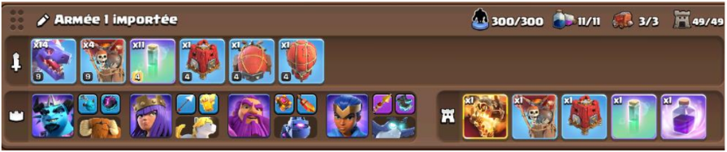
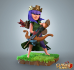
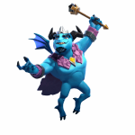
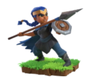
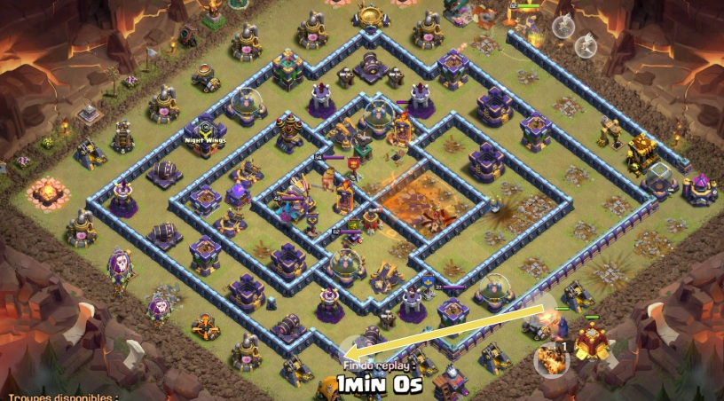
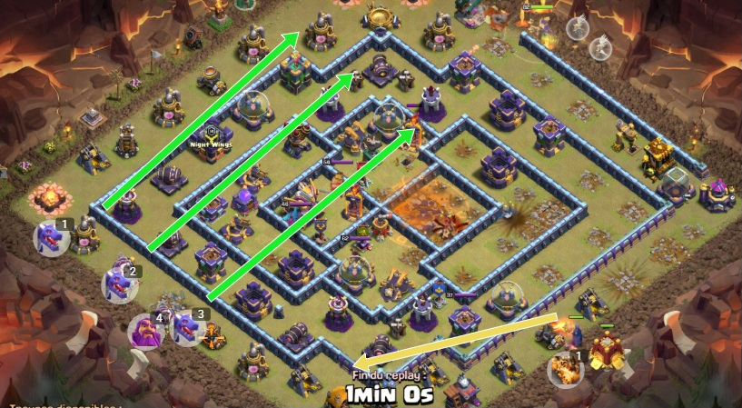

# RC Super Charge et SPAM Dragons !

Voici un petit guide sur une composition pour HDV 13, 14, et 15. La composition tourne autour de 4 points importants : la Championne Charge, le funnel de la caserne, la gestion de la flèche géante de la Reine, et enfin la partie dragon.

Nous aborderons les équipements des héros, l'objectif de chaque partie, etc. Je me base plus sur de l’HDV 14, mais globalement essayez d’avoir vos héros le plus haut possible. La flèche géante de la Reine, la championne et ses équipements sont les 2 points les plus importants à avoir de bon niveau.

Le Super Dragon du château de clan peut être modifié mais je vous le conseil il s’occupera de clean facilement une partie de village en plus de tanker d’éventuelles anti air.

## Héros et Equipements

|Héro|Equipements|
|---|:--|
|  | **REINE :** La flèche géante de niveau 15 (18 pour les HDV 15) est ultra importante, à ce niveau elle détruit les défenses anti aériennes de niveau 12, si vous n'avez pas accès à ce niveau, faites-en une priorité. Le niveau 9 est l'absolu minimum, afin de détruire en une fois les souffleurs !  Niveau 75 minimum. |
|  | **PRINCE GARGOUILLE :** A jouer derrière les dragons, son équipement sera l'orbe sombre de niveau 15 avec le gourdin météorique de niveau 18. Ses équipements ne sont pas les plus importants. Un orbe sombre avec un niveau inférieur peut suffire, et si vous n'avez pas le gourdin météorique, faites comme moi jouez la poupée protectrice, le niveau 1 suffit pour cette équipement le temps d'augmenter d'autres équipement pour d'autres Héros. Niveau 50 minimum. |
|  | **GRAND GARDIEN :** Le Grand Gardien accompagnera la partie Dragons en duo avec le Prince. Pour ses équipements la Gemme de vie de niveau 12 couplé au Grimoire Eternel de niveau 12 (et ses 7.2s d''invulnérabilité) vous permettront d'offrir une énorme survivabilité à vos nombreux Dragons ! Investir dans ses équipements est rentable et adapté à d'autres compositions très communes ! Niveau 50 minimum.|
|  | **CHAMPIONNE :** LA PIERRE ANGULAIRE de votre attaque. Coté équipements les Electro boots sont obligatoires, de niveau 1 elles suffissent à faire le travail, niveau 9 est très confortable, et un niveau 15 sera vraiment optimal en termes de stats et régénération. Je vous conseille d''investir dedans jusqu'au niveau 9 dans un premier temps ou garder au niveau 1 si vous n'avez pas encore augmenté votre second équipement, la Lance Brutale. Montez-la au plus haut niveau possible, niveau 18 vous êtes très bien cependant objectif, les 7 attaques. Bouclier de niveau élevé peut la remplacer (minimum 15). Niveau 25 minimum a priorisé son niveau 30 !!|

## DEROULE DE L’ATTAQUE ET OBJECTIFS (Exemple des parties avec une attaque sur un HDV 15)

### > Charge Championne

Objectifs de cette première partie : 
-	Déblayer un coin de la carte 
-	Prendre de grosses défenses adverses (catapulte, TDE, arc-X, Château de clan, Aigle, HDV, défenses Anti Air). Viser avec la championne la zone la plus dense en défense, et utiliser assez tôt la capacité de la lance brutale pour vous dégager le chemin et économiser ainsi des sorts d’invisibilité. N’oubliez pas un sort d’invisibilité dure 4s. Après un peu d’entrainement en partie normal vous allez vite réussir vos partie Championne.  Conseil : Certaines défenses à faible point de vie vous prendront 2 attaques de la Championne, pour optimiser votre attaque vous pouvez rendre invisible ces défenses après une seule attaque et compter sur l’aura des bottes pour finir le travail.

### > Reine

Objectifs de cette partie : 
-	Prendre le ou les souffleurs qui gêneraient votre partie Dragon. 
-	Détruire des anti-aériens en même temps que des souffleurs si possibles. La qualité de votre flèche géante dépend du nombre de ces objectifs qu’elle aura pris. CONSEIL :  Ne soyez pas trop ambitieux sur votre flèche. Le plus important reste de détruire les souffleurs qui dérangeraient vos dragons. Louper les souffleurs car on veut essayer de prendre 2 souffleurs et 2 antis aériennes est trop risqué parfois !

### > Caserne

Objectifs de cette partie :
-	Nettoyer un des coins accolés à la 1ère partie
-	Créer un couloir pouvoir votre partie Dragon, et éviter de fail time.

### > SPAM Dragons
En général si tout à bien été fait jusque-là cette partie est la plus simple ! on fait une belle ligne de Dragons bien répartie, on met notre prince et le Grand Gardien et c’est partie ! Il ne vous reste plus qu’à lancer votre sort de Rage sur le plus gros compartiment restants, là où il resterait de gros bâtiments (TDE, aigle si pas pris plus tôt etc.). Vous pouvez utilisez sur ce même timing la capacité de votre prince, ATTENTION A L’ORIENTATION de votre prince pour le trajet de l’orbe. Et enfin la capacité Grand Gardien lorsque vos Dragons prendront le plus de dégâts. MON CONSEIL : SI l’HDV n’a pas été pris avant par la Championne par exemple, conservez la capacité du Grand Gardien au moment où l’HDV est détruit, car l’’explosion et le poison de l’HDV feront énormément de dégâts à vos Dragons !

## Bilan
La composition est extrêmement forte et vous permettra, si vous maîtrisez bien la partie championne et votre flèche géante, de nombreux perfs, et ce même sur des HDV 15 voir 16 ! 
Entrainez-vous en attaques normales, puis en classé avant de vous lancer en GDC, mais c’est une composition qui reste plutôt simple une fois prise en main ! 
Concernant les familiers, vous les débloquer à cette HDV, pour la championne la licorne ou la chouette seront le plus adapté. Je vous conseil plutôt la licorne car elle restera derrière votre championne et aura moins de chance d’activer le CDC ennemi ou d’aller mourir seul pendant que vous êtes invisible ! 

